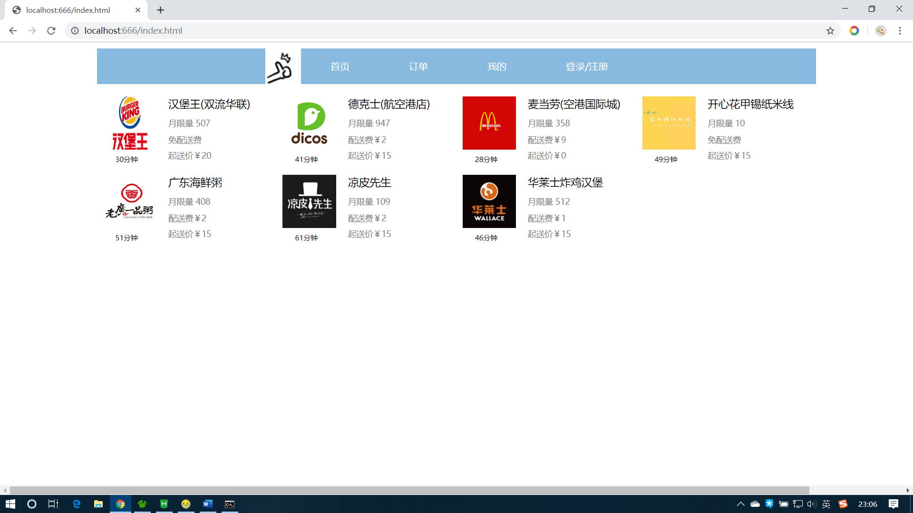
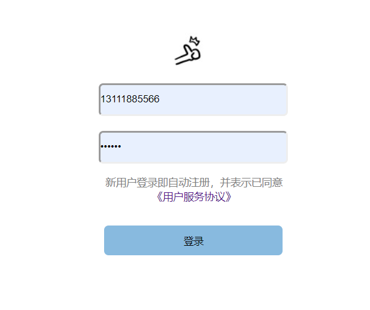
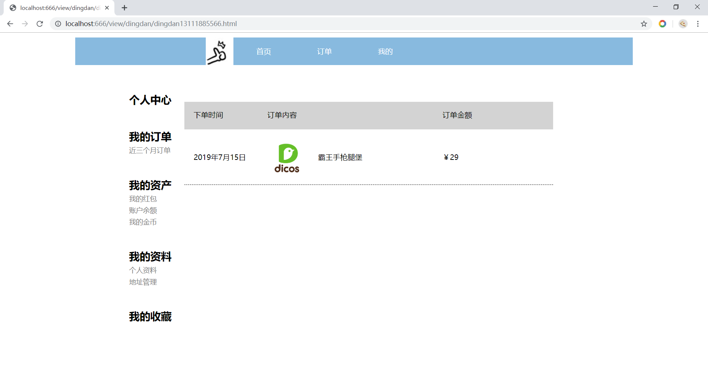
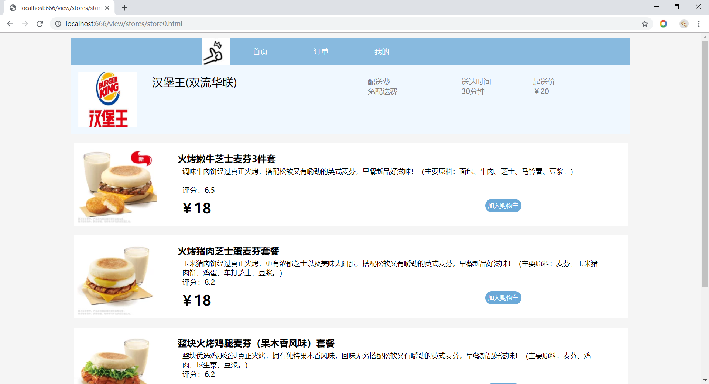

2019-07实训小组项目“饿了呀”

项目操作流程

1.首先在命令行窗口打开index.js文件所在目录，在命令行窗口输入node index.js

 
2.运行成功之后在浏览器输入: http://localhost:666/index.html 进入首页 如图

 
3.首先点击登录/注册按钮进行注册或登录
 跳转到登录注册界面
 

3.输入账号：13111885566  密码：123456 （可以在数据库表user中看到用户信息）
点击登录，登录成功后2秒跳转回首页

 
4.点击订单可以查询到该用户的订单

 
5.点击任意店铺进入点餐（添加购物车功能暂未实现）

 

 
